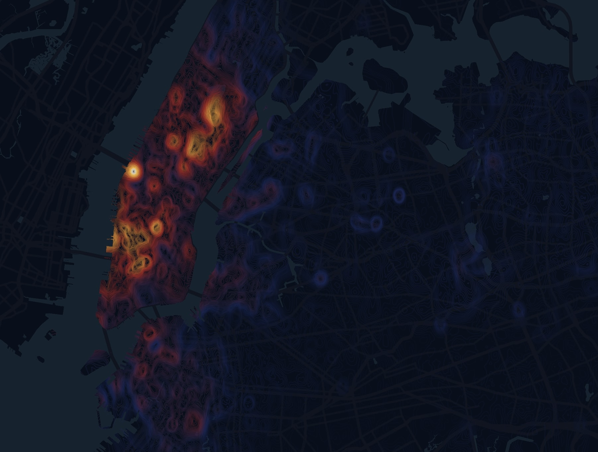

# [NYC Property Price Per Sq Ft HeatMap](https://roxyi.github.io/nyc_psf_heatmap/)


Processed the transactions data from NYC DOF in PostGIS. Used [IDW interpolation](https://gisgeography.com/inverse-distance-weighting-idw-interpolation/) to turn scatter data to contour lines based on [Abel Vázquez's tutorial](https://abelvm.github.io/sql/contour/). Employed Mapbox GL JS to render the map at the front-end.


## Getting Started
Clone the repo
```
git clone https://github.com/Roxyi/subway_ridership.git
```

Install all dependencies
```
npm install
```

Run the app
```
Gulp
```

## Data
* [NYC DOF](https://www1.nyc.gov/site/finance/index.page)


## Built With

* [Mapbox GL JS](https://github.com/mapbox/mapbox-gl-js) - JavaScript Library for Web-Based Mapping
* [PostGIS](https://postgis.net/) - a spatial database extender for [PostgreSQL](https://www.postgresql.org/) object-relational database

## Acknowledgments

* [Abel Vázquez ](https://github.com/AbelVM)
